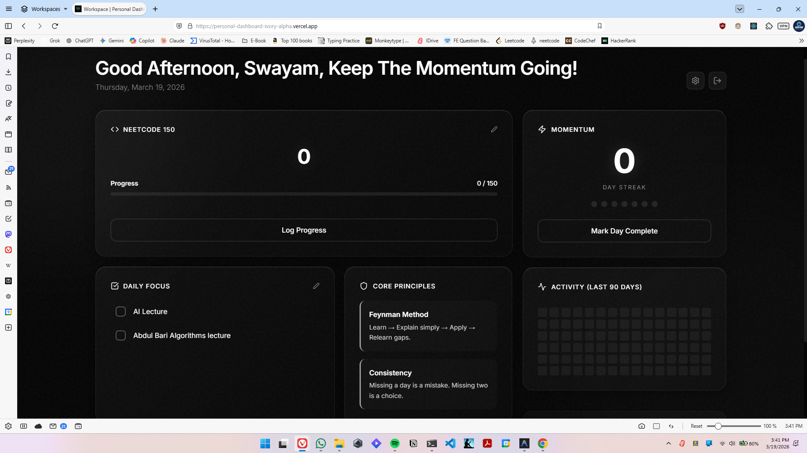

# Developer’s Personal Dashboard 🚀

A **consistency-first productivity system** designed for developers.

---

## 📸 Preview


_Add a clean screenshot of the dashboard on desktop here_


_Add a tall screenshot or GIF of the mobile app here_

---

## 🧠 Problem

Most productivity tools fail for engineers because they:
- focus on tasks instead of **momentum**
- track work but don’t enforce **execution**
- don’t align with how developers actually learn

I built this to solve one problem:

> **inconsistency in learning and building**

---

## ⚡ Solution

This dashboard is not a to-do list.

It is a **system designed to enforce consistency** through:

- 🔥 Daily streak tracking (momentum-first design)
- 📊 90-day GitHub-style activity heatmap
- 🧠 DSA milestone tracking (NeetCode 150)
- ⚙️ Customizable developer-focused tasks
- 🎯 “2 lectures → build project” mindset reinforcement
- 🎉 Instant feedback loops (milestones, streaks, perfect days)

Inspired by:
- **Duolingo** (streak psychology)
- **GitHub** (activity visualization)

---

## ✨ Features

### 🔥 Momentum System
- Daily streak tracking with undo support
- Visual reinforcement via streak history
- Milestone celebrations (7, 30, 100 days)

### 📊 Activity Tracking
- 90-day heatmap
- Weekly consistency stats
- Perfect day detection

### 💻 Developer-Focused Workflow
- NeetCode 150 progress tracker
- Custom task system (AI, DSA, Gym, Projects, etc.)
- Keyboard-accessible interactions

### ⚙️ Customization
- Add / remove / reorder tasks
- Persistent user state
- JSON export/import support

---

## 🛠 Tech Stack

- **Frontend**: Next.js (React, App Router)
- **Database & Auth**: Supabase (PostgreSQL + RLS)
- **Styling**: Custom CSS (no UI frameworks)
- **Icons**: Lucide React
- **Animations**: CSS + canvas-confetti

---

## 🔐 Security Approach

- Row Level Security (RLS) ensures user-level data isolation
- React prevents direct DOM injection (basic XSS protection)
- Minimal dependency footprint

---

## 📱 Progressive Web App

- Installable on mobile
- Optimized for AMOLED displays (`#050505`)
- Designed for always-on visibility

---

## 🚀 Getting Started

```bash
git clone https://github.com/gitruparel/personal-dashboard
cd personal-dashboard
npm install
```

Create `.env.local`:
```env
NEXT_PUBLIC_SUPABASE_URL=your-url
NEXT_PUBLIC_SUPABASE_ANON_KEY=your-key
```

Run:
```bash
npm run dev
```

---

## 📈 Roadmap

- [x] Migration to Next.js + Supabase
- [x] Cloud sync
- [ ] Lecture → project tracking system
- [ ] Multi-user support / profiles

---

## 🧠 Philosophy

This project is built on one idea:

> **Consistency beats intensity.**

The goal is not to track work.
The goal is to force execution and build momentum daily.

---

## 🤝 Contributing

Open to feedback, ideas, and improvements.

⭐ **If you found this useful, consider starring the repo.**
